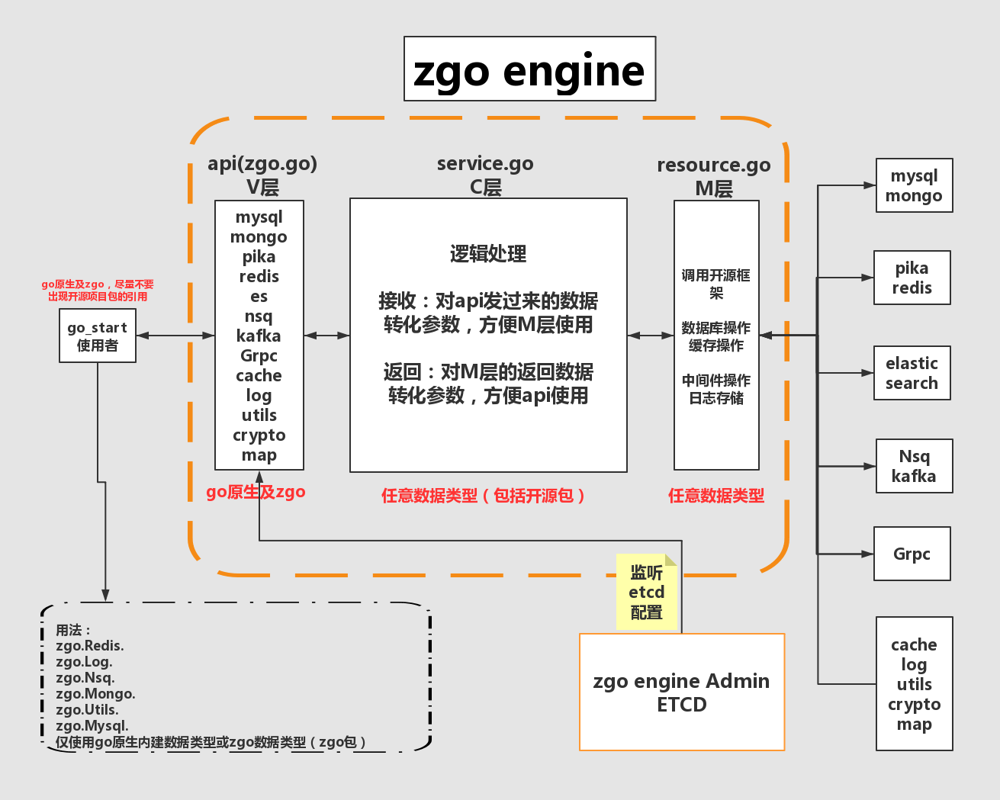

#zgo engine v1.0 <a href="README_ZH.md"> 

##为什么要搞zgo？
为了提高生产力,让开发人员把精力更多的关注在业务逻辑上，让开发人员更方便，快捷和规范化的使用各种数据库,缓存,中间件等常用开发操作

##zgo是什么？
zgo是专门为使用go语言的开发人员所设计和开发的， 它提供了对数据库，缓存，消息队列，日志存储，工具类方法，加解密，并发安全map的使用。zgo不是一个轮子,
它是在各种开源框架及各种轮子基础之上开发的，zgo是一个引擎。

##zgo的架构图

[](http://wiki.zhugefang.com/display/ZGZFRDCENTER/zgo)


##zgo的核心功能（共15个，2个数据库，2个缓存，2个消息队列，1个ES，1个Cache, 1个Log存储，1个Http，1个Grpc，4个边缘类组件）
* 1.zgo Mysql对gorm开发框架提供上层封装，通过channel内建连接池，提供高并发访问mysql，并支持函数调用时自动读写分离，开发人员无需关注主从数据库

* 2.zgo Mongodb对mgo开发框架提供上层封装，改变框架原有session复制连接的使用方法，通过channel内建连接池，提供高并发访问mongodb数据库的增删改查

* 3.zgo Pika通过channel内建连接池，支持string,hash,set,sort set,list操作
* 4.zgo Redis通过channel内建连接池，支持string,hash,set,sort set,list操作
* 5.zgo Nsq对go-nsq开发框架提供上层封装，通过channel内建连接池，一步调用即可向Nsq中生产消息，通过一个goroutine来消费消息
* 6.zgo Kafka对sarama和cluster kafka开发框架提供上层封装，支持对分区的kafka进行消息投递，一个函数调用生产和消费数据即可，减少开发流程
* 7.zgo Es通过http访问elastic search的函数调用封装，内建了DSL及模板支持，常用的mappings设置
* 8.zgo Cache提供了类似python装饰器的功能，所有开启cache功能的函数调用，通过装饰器函数支持缓存和降级缓存，是对zgo api调用的一种保护机制
* 9.zgo Log提供了对日志的收集与处理，支持从配置中心定义存储到文件系统，或消息队列Nsq，Kafka
* 10.zgo Http在iris web框架上提供了对api开发中统一，规范化的http response及响应码和错误message
* 11.zgo Grpc提供了对google grpc上层的封装，通过protobuf定义数据传输格式，方便client和server端的使用
* 12.zgo Utils提供了对常见的日期转换，高效Json序列与反序列化，字符编码，ip相关，输入判断，go中map和string转换等
* 13.zgo Crypto提供了常用的md5,sha1,sha256,aes,rsa,hmac等加解密函数
* 14.zgo File更加方便的一个函数调用get,set,append对文件进行操作
* 15.zgo Map提供一种并发安全的map读写操作，本质是对go中map加RWmutex的一种实现

##zgo engine的依赖
zgo engine使用etcd分布式数据库作为持久化存储，所有使用zgo建立的项目配置文件都存放到etcd，由etcd提供共享配置、服务注册、服务发现、监听机制

微服务项目建立时从zgo engine admin平台申请项目id，并配置所用资源，你可能会使用mongo,redis或nsq，并开启日志存储到nsq，这样的一个服务

##快速开启zgo start项目
###zgo_start项目是使用zgo engine的模板项目
git clone https://git.zhugefang.com/gocore/zgo_start

git clone这个项目后，改名成自己开发的项目名字，然后删除掉.git目录，这是一个模板，内含有samples目录，其中的代码可以直接copy使用

安装docker,在zgo_start目录下,有docker-compose.yml文件，本地一次性跑起es,redis,mongodb,mysql,nsq,kafka等组件（如果你愿意可以注释掉其中不用的）

前台执行

docker-compose up

后台执行

docker-compose up -d

选项一：在zgo_start当前目录下编译mac运行的二进制文件

go build -o zgo_start

./zgo_start


选项二：在当前目录下编译linux运行的二进制文件，因为docker容器里用的是linux环境

CGO_ENABLED=0 GOOS=linux GOARCH=amd64 go build -o zgo_start

用docker制作image(dck.zhuge.test是任意一个标识，如果愿意你可以改为rubinus/zgo_start)

docker build -t dck.zhuge.test/zgo_start .

把镜像文件push到开发环境的私有仓库

docker push dck.zhuge.test/zgo_start

###如果把zgo start做为一个提供api接口访问的web微服务时的依赖
我们使用了开源的go web框架iris，仅当你创建web服务时使用下面的框架

import github.com/kataras/iris


##快速开始使用zgo engine

###本地开发
* 启动zgo engine，可以在你项目的main.go中直接调用下面的函数，这样zgo engine将会启动
```gotemplate
    err := zgo.Engine(&zgo.Options{
		Env:      "local", //表示你在本机上开发， dev/qa/pro都表示非本机开发
		Loglevel: "debug", //本机开发采用debug的日志模式
		Project:  "zgo_start", //项目id: zgo_start是从zgo engine admin平台申请得到的，正式上可能是一串数字

		//如果是在本地开发可以对下面的组件开启使用，如果非local开发，不需要填写，使用的配置是etcd
		Redis: []string{
			"redis_label_bj",
		},
		Mysql: []string{
			"mysql_sell_1",
			"mysql_sell_2",
		},
	})
	if err != nil {
		panic(err)
	}
```
如果你启用了例如上面这样的redis组件，仅仅用到了一个redis的话，那么在程序中你可以直接像下面这样操作
```gotemplate
    val, err := zgo.Redis.Get(context.TODO(), "key:123")
    
    result := zgo.Utils.StringToMap(val.(string)) //把redis中的string转为go对象map
    
    if err != nil {
    zgo.Log.Error(err)  //把错误日志存储起来，你不用关心如何存储，只需要调用一下这个函数zgo.Log.Error()
        return
    } 
    fmt.Println(result)
```

如果你启用了比如mysql这个组件，同时又用到了1个以上的label，那么在程序中使用时你必须要这样
```gotemplate
    ms, err := zgo.Mysql.New("mysql_sell_1") //首先通过New一个实例出来，并填写label的名字，这个mysql_sell_1实际上来自于etcd中的配置资源key
    
    if err != nil {
        zgo.Log.Error(err) //你无需要关注如何存储，etcd中的配置会帮你定义是存储到什么地方去
    }
    
    ms.Get() //输入查询参数，返回数据
```

##详解zgo engine组件使用
我们在zgo_start/samples目录中提供了大量的demo实例，可以直接copy到实际的开发中

###zgo Mysql组件使用
如果你想用zgo.Mysql来向mysql数据库中插入一条数据，你可以这么做，首先你要声明一个类型是House的结构体，
然后再实例化这个结构体，为此我创建了一个id是123,name是zhugefang的，这样一个实例，接下来我调用了一个AddHouse的函数，
并传入了三个参数，第一个是上下文context.TODO()表示什么也不做，只是传递上下文而已，第二个参数是刚刚实例化的House的指针，第三个是string类型的bj

```gotemplate
type House struct {
	Id   int `json:"id"`
	Name string `json:"name"`
}

h := House{
    Id: 123,
    Name: "zhugefang",
}

err := AddHouse(context.TODO(), &h ,"bj")
if err != nil {
    panic(err)
}
//二手房房源，添加操作
func AddHouse(ctx context.Context, h *House, city string) error {
	ms, err := zgo.Mysql.MysqlServiceByCityBiz(city, "sell")
	if err != nil { //首先通过city获取到了它对应的label
		return err
	}
	dbname, err1 := ms.GetDbByCityBiz(city, "sell")
	if err1 != nil {    //通过城市获取数据库的名字
		return err1
	}

	args := make(map[string]interface{})
	args["obj"] = h
	args["table"] = dbname + "." + h.TableName()
	err2 := mysqlService.Create(ctx, args)
	if err2 != nil {
		return err2
	}
	if h.Id > 0 {
		return nil
	}
	return errors.New("创建失败")
}
```

###zgo Mongo组件使用
如果你想从mongo中查询一条记录的话，你可以像下面这样做
```gotemplate
type User struct {  //声明一个类型是User的结构体
	Name string `json:"name"`
	Age   int    `json:"age"`
}

func GetUser()  {   //查询函数
	u := User{}
	//输入参数：上下文ctx，args具体的查询操作参数
	args := make(map[string]interface{})
	query := make(map[string]interface{})
	query["name"] = "abc"

	args["db"] = "test"
	args["table"] = "user"
	args["query"] = query
	
	res,err := getUser(&u,args)
	if err != nil {
		fmt.Println(err)
	}
	fmt.Println(res)
}

func getUser(u *User, args map[string]interface{}) (*User, error){
	//还需要一个上下文用来控制开出去的goroutine是否超时
	ctx, cancel := context.WithTimeout(context.Background(), 20*time.Second)
	defer cancel()
	

	result, err := zgo.Mongo.FindOne(ctx, args)

	if err != nil {
		zgo.Log.Error("取mongo中的数据失败" + err.Error())
		return nil,err
	}

	select {
	case <-ctx.Done():
		return nil,errors.New("超时")
	default:
		zgo.Utils.MapToStruct(result, u)    //用返回的map转成user结构体
	}
	return u,nil
}
```

###zgo Pika组件使用
pika的使用比较简单，下面是一个向pika中存放的hash，key是key101，field是name，value是Bob的记录
```gotemplate
    ctx, cancel := context.WithTimeout(context.Background(), 10*time.Second)
	defer cancel()

	result, err := zgo.Pika.Hset(ctx, "key101", "name", "Bob")
	if err != nil {
		zgo.Log.Error(err)
	}
	
	select {
	case <-ctx.Done():
	    zgo.Log.Error(err)
		fmt.Println("超时")
	default:
		fmt.Print(result)
	}
```
###zgo Redis组件使用
以下是一个在iris的web框架下，向string的数据结构中写入标准的json数据，然后查询出来，并发送数据到nsq，kafka的实现
```gotemplate
func Hello(ctx iris.Context) {
	name := ctx.URLParam("name")    //从路由中取到query中的参数name

	var errStr string
	cotx, cancel := context.WithTimeout(context.Background(), 5*time.Second) //you can change this time number
	defer cancel()

	key := fmt.Sprintf("%s:%s:%s", "zgo", "start", name)

	s := `{"branch":"beta","change_log":"add the rows{10}","channel":"fros","create_time":"2017-06-13 16:39:08","firmware_list":"","md5":"80dee2bf7305bcf179582088e29fd7b9","note":{"CoreServices":{"md5":"d26975c0a8c7369f70ed699f2855cc2e","package_name":"CoreServices","version_code":"76","version_name":"1.0.76"},"FrDaemon":{"md5":"6b1f0626673200bc2157422cd2103f5d","package_name":"FrDaemon","version_code":"390","version_name":"1.0.390"},"FrGallery":{"md5":"90d767f0f31bcd3c1d27281ec979ba65","package_name":"FrGallery","version_code":"349","version_name":"1.0.349"},"FrLocal":{"md5":"f15a215b2c070a80a01f07bde4f219eb","package_name":"FrLocal","version_code":"791","version_name":"1.0.791"}},"pack_region_urls":{"CN":"https://s3.cn-north-1.amazonaws.com.cn/xxx-os/ttt_xxx_android_1.5.3.344.393.zip","default":"http://192.168.8.78/ttt_xxx_android_1.5.3.344.393.zip","local":"http://192.168.8.78/ttt_xxx_android_1.5.3.344.393.zip"},"pack_version":"1.5.3.344.393","pack_version_code":393,"region":"all","release_flag":0,"revision":62,"size":38966875,"status":3}`

	//存放一段标准的json到redis的string数据结构中
	_, err := zgo.Redis.Set(cotx, key, s, 100000)
	if err != nil {
		zgo.Log.Error(err)
		return
	}

	//再从redis中取出来
	val, err := zgo.Redis.Get(cotx, key)

        //转换成标准的object给接口调用者
	result := zgo.Utils.StringToMap(val.(string))

	if err != nil {
		zgo.Log.Error(err)
		return
	}

	//发送到nsq
	zgo.Nsq.Producer(cotx, "zgo_start", []byte(s))

	//发送到kafka
	zgo.Kafka.Producer(cotx, "zgo_start", []byte(s))

	select {
	case <-cotx.Done():
		errStr = "call redis hgetall timeout"
		zgo.Log.Error(errStr) //通过zgo.Log统计日志
		//ctx.JSONP(iris.Map{"status": 201, "msg": errStr}) //返回jsonp格式
		
		zgo.Http.JsonpErr(ctx, errStr)
	default:
		//ctx.JSONP(iris.Map{"status": 200, "data": result})
		
		zgo.Http.JsonpOK(ctx, result) //最终通过zgo.Http组件把数据以object的形式返回

	}

}
```

###zgo Es组件使用
es的操作我们做了二层封装，第一个是dsl查询语句的封装，第二个是查询函数的调用封装，你可以使用下面的查询快速的操作es

```gotemplate
    ctx, _ := context.WithTimeout(context.Background(), 5*time.Second)
    
    //第一步：申明dsl查询语句
	dsl := zgo.Es.NewDsl()

	//第二步：构建dsl查询
	m1 := dsl.TermField("type_id", "101")
	m2 := dsl.TermField("city", "bj")
	m3 := dsl.TermField("housetype", "sell")
	m4 := dsl.GeoBoxField("location", location["topLeftLat"], location["topLeftLon"], location["bottomRightLat"], location["bottomRightLon"])
	dsl.Must(m1, m2, m3, m4)
	//第三步：设置dsl返回的查询域
	dsl.Set_SourceField("other_id", "keyword", "location", "sell_price")
	dsl.SetFrom(0)
	dsl.SetSize(20)
	//第四步：生成dsl查询语句为string
	dslstr := dsl.QueryDsl()
	
	//创建es查询实例，些时使用了1个以上的label
    es, err := zgo.Es.New(config.Conf.EsLabelSell)
	if err != nil {
		return nil, false
	}	
	//开始call zgo engine的ES封装函数
	data, err := es.SearchDsl(ctx, "app_guessword", "app_guessword", dslstr, nil)
	if err != nil {
		return map[string]string{}, false
	}
```
###zgo Nsq组件使用
####生产者使用producer函数，支持一次发送多条
这里是向Nsq中的 topic是nsq_label_bj的里面生产一条或多条消息
```gotemplate
    //还需要一个上下文用来控制开出去的goroutine是否超时
	ctx, cancel := context.WithTimeout(context.Background(), 10*time.Second)
	defer cancel()
	
	topic := "nsq_label_bj"
	
	body := []byte(fmt.Sprintf("msg is--%s--%d", "test", 1))
	
	//发送单条消息到Nsq,rch是一个带有buffer的channel,如果<-rch的值是1表示成功
	rch, err = zgo.Nsq.Producer(ctx, topic, body)
	
	
	bodyMutil := [][]byte{
		body,
		body,
		body,
		body,
		body,
	}	
	//一次发送多条消息到Nsq,rch是一个带有buffer的channel,如果<-rch的值是1表示成功
	rch, err = zgo.Nsq.ProducerMulti(ctx, topic, bodyMutil)
	
	out := make(chan int, 1)
	select {
	case <-ctx.Done():
		fmt.Println(label, "超时")
		out <- 10001 //错误时
		return out
	case b := <-rch:
		if b == 1 {
			out <- 1

		} else {
			out <- 10001 //错误时
		}
	}

	return out 你可以定义一个chan of int 把结果投递出去
```
####消费者使用consumer函数
这里相对来说比较复杂点，不过逻辑相对比较清晰，这里是从topic是nsq_label_bj里，用一个channel去消费，你可以写任何的channel的名字，表示是你消费的
```gotemplate

    type chat struct {
        Topic   string
        Channel string
    }
    
    func (c *chat) Consumer() {
        zgo.Nsq.Consumer(c.Topic, c.Channel, c.Deal) //这里使用了一个go语言的闭包的功能
    }
    
    //处理消息
    func (c *chat) Deal(msg zgo.NsqMessage) error { //这里需要指定一个zgo engine中定义的类型NsqMessage
    
        fmt.Println("接收到NSQ", msg.NSQDAddress, ",message:", string(msg.Body))
        
        //to do something for u work
    
        return nil
    }
    
    接下来是如何调用这个struct的函数
    
    c := chat{
        Topic:   "nsq_label_bj",
        Channel: "custom-chan-101",
    }
    c.Consumer() //开始了消费者

最后一点小建议，这个消费者在程序运行时是一直在消费着，而不是只调用一次，所以你应该把些消费的内容运行在一个goroutine里，同时加上一行
    for {
        select {
        case <-time.Tick(time.Duration(5 * time.Second)):
            fmt.Println("一直在消费着") //this is a demo sample
        }
    }

```

###zgo Kafka组件使用
####生产者使用producer函数，支持一次发送多条
这里是向Kafka中的 topic是kafka_label_bj的里面生产一条或多条消息
```gotemplate
    //还需要一个上下文用来控制开出去的goroutine是否超时
	ctx, cancel := context.WithTimeout(context.Background(), 10*time.Second)
	defer cancel()
	
	topic := "kafka_label_bj"
	
	body := []byte(fmt.Sprintf("msg is--%s--%d", "test", 1))
	
	//发送单条消息到Kafka,rch是一个带有buffer的channel,如果<-rch的值是1表示成功
	rch, err = zgo.Kafka.Producer(ctx, topic, body)
	
	
	bodyMutil := [][]byte{
		body,
		body,
		body,
		body,
		body,
	}	
	//一次发送多条消息到Kafka,rch是一个带有buffer的channel,如果<-rch的值是1表示成功
	rch, err = zgo.Kafka.ProducerMulti(ctx, topic, bodyMutil)
	
	out := make(chan int, 1)
	select {
	case <-ctx.Done():
		fmt.Println(label, "超时")
		out <- 10001 //错误时
		return out
	case b := <-rch:
		if b == 1 {
			out <- 1

		} else {
			out <- 10001 //错误时
		}
	}

	return out 你可以定义一个chan of int 把结果投递出去
```
####消费者使用consumer函数，这里带有是否分区的kafka类型
这里相对来说比较复杂点，不过逻辑相对比较清晰，这里是从topic是kafka_label_bj里，用一个groupId去消费，你可以写任何的groupId的名字，表示是你消费的
```gotemplate

    type chat struct {
        Topic   string
        GroupId string
    }
    
    func (c *chat) Consumer(label string) {
        consumer, _ := zgo.Kafka.Consumer(c.Topic, c.GroupId)   //开始消费
        for {
            select {
            case part, ok := <-consumer.Partitions():   //从带有分区的kafka集群上消费数据
    
                if !ok {
                    return
                }
                go func(pc cluster.PartitionConsumer) {
                    for msg := range pc.Messages() {
    
                        fmt.Printf("==message===%d %s\n", msg.Offset, msg.Value)
                        
                        //to do something for u work
                        
                    }
                }(part)
                
            //case <-signals:
            //	fmt.Println("activity no signals ...")
            //	return
    
            case msg, ok := <-consumer.Messages():  //从不分区的kafka消费数据
                if ok {
                    //fmt.Printf("==message===%d %s\n", msg.Offset, msg.Value)
    
                    //to do something for u work
    
                }
    
            }
        }
    }

    //如果使用这个struct
	c := chat{
		Topic:   "kafka_label_bj",
		GroupId: "groupId-101",
	}
	c.Consumer(label_bj)
	
    最后一点小建议，这个消费者在程序运行时是一直在消费着，而不是只调用一次，所以你应该把些消费的内容运行在一个goroutine里，同时加上一行
    for {
        select {
        case <-time.Tick(time.Duration(5 * time.Second)):
            fmt.Println("一直在消费着") //this is a demo sample
        }
    }

```

###zgo Cache组件使用
这里是一个使用Cache组件的demo，它有2个函数，GetData用来测试正常缓存，GetData1用来测试降级缓存。正常使用的方法是，如果你对你的查询操作，希望自动叠加上缓存功能，可以直接调用zgo.Cache.Decorate(传入你的函数名)(你原来函数的输入参数)，每次调用都用同样的方式；如果你想使用降级缓存可以zgo.Cache.TimeOutDecorate
```gotemplate
type CacheDemo struct {}
func (m CacheDemo) run() {
	ctx, cancel := context.WithTimeout(context.Background(), 50*time.Second)
	defer cancel()

	//查询参数
	zgo.Engine(&zgo.Options{
		Env:     "local",
		Project: "zgo_start,
		Pika: []string{
			"pika_label_rw", // 需要一个pika或是redis的配置，作为缓存的载体
		},
	})
	param := make(map[string]interface{})
	param["ceshi1"] = 1
	param["ceshi2"] = 2
	param["ceshi3"] = 2
	param["ceshi4"] = 2
	param["ceshi5"] = 2
	param["ceshi6"] = 2
	param["ceshi7"] = 2
	// 无缓存
	start := time.Now().Unix()
	m.GetData(ctx, param)
	fmt.Println("正常用时", time.Now().Unix()-start)
	fmt.Println("")

	// 正常缓存
	start = time.Now().Unix()
	zgo.Cache.Decorate(m.GetData, 10)(ctx, param)
	fmt.Println("第一次请求用时", time.Now().Unix()-start)

	// 正常缓存第二次请求
	time.Sleep(3)
	fmt.Println("")
	fmt.Println("-------第二次请求开始-----")
	start = time.Now().Unix()
	zgo.Cache.Decorate(m.GetData, 10)(ctx, param)
	fmt.Println("第二次请求用时", time.Now().Unix()-start)

	start = time.Now().Unix()
	fmt.Println("")
	fmt.Println("")
	fmt.Println(start)
	fmt.Println("降级缓存测试：")
	// 降级缓存正常情况
	zgo.Cache.TimeOutDecorate(m.GetData1, 10)(ctx, param)
	fmt.Println("正常降级缓存用时", time.Now().Unix()-start)
	fmt.Println("")
	fmt.Println("")
	start = time.Now().Unix()
	// 超时情况
	zgo.Cache.TimeOutDecorate(m.GetData1, 1)(ctx, param)
	fmt.Println("超时降级缓存用时", time.Now().Unix()-start)
}

func (m CacheDemo) GetData(ctx context.Context, param map[string]interface{}) (interface{}, error) {
	time.Sleep(2 * time.Second)
	return map[string]interface{}{"test": "测试数据"}, nil
}

func (m CacheDemo) GetData1(ctx context.Context, param map[string]interface{}) (interface{}, error) {
	time.Sleep(2 * time.Second)
	return map[string]interface{}{"test": "测试数据"}, nil
}
```
###zgo Log组件使用
这个组件是zgo engine中最简单的，你只需要在你认为会出错，或是有警告的地方，调用它就可以了
```gotemplate
    zgo.Log.Error("这里是你想写入的任何log的消息")
```

zgo engine会替你把这些日志，输出到文件系统，或者是Nsq中，又或者是Kafka中，具体输出到什么地方可以在zgo engine admin平台动态配置，会热更新，时时变化


##开发环境联调
你需要在zgo_start/config/dev.json中，指定Env的值是"dev" 和 Project的值（来自zgo engine admin配置中心）
如果你愿意你可以继续为LogLevel和Version指定值

##生产环境部署
在项目的zgo_start/deploy目录中分别有k8s和istio的子目录
###yaml文件编写

####k8s yaml的编写
v1 version的yaml文件不仅有Deployment，还带有Service Kind
```yaml
kind: Service
apiVersion: v1
metadata:
  name: start
  labels:
    app: start
spec:
  selector:
    app: start
  ports:
    - name: http
      port: 80
---
apiVersion: extensions/v1beta1
kind: Deployment
metadata:
  name: start-v1
spec:
  replicas: 1
  template:
    metadata:
      labels:
        app: start
        version: v1
    spec:
      restartPolicy: Always
      containers:
        - name: start
          image: registry.cn-beijing.aliyuncs.com/zhuge/start:v1
          ports:
            - containerPort: 80
          livenessProbe:
            httpGet:
              path: /
              port: 80
            initialDelaySeconds: 2
            timeoutSeconds: 10
            periodSeconds: 3
          readinessProbe:
            httpGet:
              path: /
              port: 80
            initialDelaySeconds: 2
            timeoutSeconds: 5
            periodSeconds: 3
---
```
v2 的yaml文件仅有Deployment Kind就可以了
```yaml
apiVersion: extensions/v1beta1
kind: Deployment
metadata:
  name: start-v2
spec:
  replicas: 1
  template:
    metadata:
      labels:
        app: start
        version: v2
    spec:
      restartPolicy: Always
      containers:
        - name: start
          image: registry.cn-beijing.aliyuncs.com/zhuge/start:v2
          ports:
            - containerPort: 80
          livenessProbe:
            httpGet:
              path: /
              port: 80
            initialDelaySeconds: 2
            timeoutSeconds: 10
            periodSeconds: 3
          readinessProbe:
            httpGet:
              path: /
              port: 80
            initialDelaySeconds: 2
            timeoutSeconds: 5
            periodSeconds: 3
---

```

####istio yaml的编写，这是用来控制流量，实现访问与蓝绿发布所用的
关于gateway的部分，主要是使用istio的ingressgateway来让外部流量，流入k8s集群;同时VirtualService连接k8s集群的service的label，通过service再关联到k8s集群中Pod的label上
而pod就是上面使用Deployment声明后部署的 
gateway.yaml如下
```yaml
apiVersion: networking.istio.io/v1alpha3
kind: Gateway
metadata:
  name: start-gateway
spec:
  selector:
    istio: ingressgateway
  servers:
    - port:
        number: 80
        name: http
        protocol: HTTP
      hosts:
        - "*"
---
apiVersion: networking.istio.io/v1alpha3
kind: VirtualService
metadata:
  name: start
spec:
  hosts:
    - "*"
  gateways:
    - start-gateway
  http:
    - match:
        - uri:
            exact: /
      route:
        - destination:
            host: start
            port:
              number: 80
```

如果你想控制2个版本的流量，需要再建立一个DestinationRule，其中的subsets有2个version的label
```yaml
apiVersion: networking.istio.io/v1alpha3
kind: DestinationRule
metadata:
  name: start
spec:
  host: start
  subsets:
    - name: v1
      labels:
        version: v1
    - name: v2
      labels:
        version: v2
---
```
这样你就可以通过route功能实现流量控制新旧2个version的更新
```yaml
apiVersion: networking.istio.io/v1alpha3
kind: VirtualService
metadata:
  name: start
spec:
  hosts:
    - start
  http:
    - route:
        - destination:
            host: start
            subset: v1
          weight: 50
        - destination:
            host: start
            subset: v2
          weight: 50
```

##zgo engine各组件的性能测试

###zgo mysql
balabala...
###zgo mongo
balabala...
###zgo pika
balabala...
###zgo redis
balabala...
###zgo es
balabala...
###zgo nsq
balabala...
###zgo kafka
balabala...

##zgo engine突击队成员
* 指挥官：杨丽娟
* 队长：朱大仙儿
* 队员：张建国
* 队员：卢泰祥
* 队员：刘伟
* 队员：王士宝

##zgo 测试小组成员
* 张小飞
* 张东磊
* 张树振

copyright@2019 by zhuge.com


###zgo engine测试方法使用：进入到比如zgonsq目录下执行，生成相应的.out，并通过go tool pprof查看

// 查看测试代码覆盖率

go test -coverprofile=c.out

go tool cover -html=c.out

// 查看cpu使用

go test -bench . -cpuprofile cpu.out

go tool pprof cpu.out

// 查看内存使用

go test -memprofile mem.out

go tool pprof mem.out

执行pprof后，然后输入web  或是quit 保证下载了svg

https://graphviz.gitlab.io/_pages/Download/Download_source.html

下载graphviz-2.40.1后进入目录

./configure

make

make install


docker-compose up -d

##zgo 测试环境
阿里云内网
10.45.146.41
阿里云公网
123.56.173.28

数字是端口号，供测试zgo admin使用，跑在docker里

2个mysql
3307
3308

2个mongo
27018
27019

2个redis
6380
6381

1个kafka
9202

1个nsq
4150
管理页面
http://123.56.173.28:4171/

1个etcd
2380
管理页面
http://47.93.163.209:9097/
