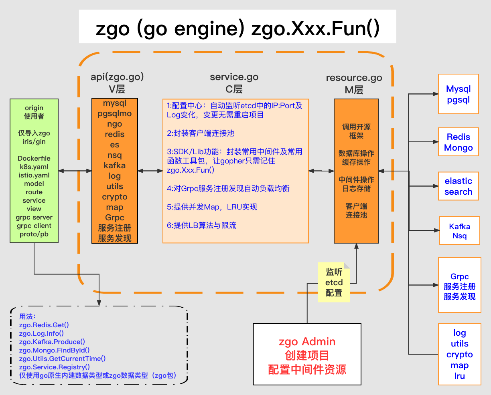

# zgo engine v1.0.5 <a href="README_ZH.md"></a>

## 为什么要搞zgo？

为了提高生产力,让开发人员把精力更多的关注在业务逻辑上，让开发人员更方便，快捷和规范化的使用各种数据库,缓存,中间件等常用开发操作

## zgo是什么？

zgo是专门为使用go语言的开发人员所设计和开发的， 它提供了对数据库，缓存，消息队列，日志存储，工具类方法，加解密，并发安全map的使用。zgo不是一个轮子, 它是在各种开源框架及各种轮子基础之上开发的，zgo是一个引擎。

## zgo的架构图

[](http://wiki.examplefang.com/display/ZGZFRDCENTER/zgo)

## zgo的核心功能（共25个，6个数据库，2个缓存，3个消息队列，1个ES，1个Cache, 1个Log存储，1个Http，1个Grpc，1个Map，1个负载，1个限流，3个工具类组件）

* 1.zgo Mysql对gorm开发框架提供上层封装，通过channel内建连接池，提供高并发访问mysql，并支持函数调用时自动读写分离，开发人员无需关注主从数据库
* 2.zgo Mongodb对mgo开发框架提供上层封装，改变框架原有session复制连接的使用方法，通过channel内建连接池，提供高并发访问mongodb数据库的增删改查
* 3.zgo Pika通过channel内建连接池，支持string,hash,set,sort set,list操作
* 4.zgo Redis通过channel内建连接池，支持string,hash,set,sort set,list操作
* 5.zgo Nsq对go-nsq开发框架提供上层封装，通过channel内建连接池，一步调用即可向Nsq中生产消息，通过一个goroutine来消费消息
* 6.zgo Kafka对sarama和cluster kafka开发框架提供上层封装，支持对分区的kafka进行消息投递，一个函数调用生产和消费数据即可，减少开发流程
* 7.zgo Es通过http访问elastic search的函数调用封装，内建了DSL及模板支持，常用的mappings设置
* 8.zgo Cache提供了类似python装饰器的功能，所有开启cache功能的函数调用，通过装饰器函数支持缓存和降级缓存，是对zgo api调用的一种保护机制
* 9.zgo Log提供了对日志的收集与处理，支持从配置中心定义存储到文件系统，或消息队列Nsq，Kafka
* 10.zgo Http在iris web框架上提供了对api开发中统一，规范化的http response及响应码和错误message
* 11.zgo Grpc提供了对google grpc上层的封装，通过protobuf定义数据传输格式，方便client和server端的使用
* 12.zgo Map提供一种并发安全的map读写操作，本质是对go中map加RWmutex的一种实现，使用场景top100，最近100条消息
* 13.zgo Utils提供了对常见的日期转换，高效Json序列与反序列化，字符编码，ip相关，输入判断，go中map和string转换等
* 14.zgo Crypto提供了常用的md5,sha1,sha256,aes,rsa,hmac，对称与非对称等加解密函数
* 15.zgo File更加方便的一个函数调用get,set,append对文件进行操作
* 16.zgo Postgres提供对Postgres的连接封装
* 17.zgo Neo4j提供对Neo4j的连接封装
* 18.zgo ClickHouse提供对列式数据库clickhouse的连接封装
* 19.zgo Rabbitmq提供对Rabbitmq的封装
* 20.zgo Limiter提供bucket的限流
* 21.zgo LB提供负载均衡
* 22.zgo Mgo提供对官方mongodb驱动的封装
* 23.zgo Etcd提供对操作etcd的连接封装
* 24.zgo Trace提供对某个fun的追踪消耗时间

## zgo engine的依赖

* zgo engine使用etcd分布式数据库作为持久化存储，所有使用zgo engine建立的项目配置文件都存放到etcd，由etcd提供共享配置、服务注册、服务发现、监听机制

* Etcd数据库的安全性，由于其采用了raft协议实现了强一致性的数据同步机制，确保分布式节点配置文件的同步性，另外速度方面也比较快,因为etcd的key以B树的形式存储在内存中, value以B+树的形式存储在硬盘中

* 微服务项目建立时从zgo engine admin平台申请项目id，并配置所用资源，你可能会使用mongo,redis或nsq，并开启日志存储到nsq，这样的一个服务

## 快速开启zgo origin项目

### origin项目是使用zgo engine的模板项目

git clone https://github.com/gitcpu-io/origin

git clone这个项目后，改名成自己开发的项目名字，然后删除掉.git目录，这是一个模板，内含有samples目录，其中的代码可以直接copy使用

安装docker,在origin目录下,有docker-compose.yml文件，本地一次性跑起es,redis,mongodb,mysql,nsq,kafka等组件（如果你愿意可以注释掉其中不用的）

前台执行

docker-compose up

后台执行

docker-compose up -d

选项一：在origin当前目录下编译mac运行的二进制文件

go build -o origin

./origin

选项二：在当前目录下编译linux运行的二进制文件，因为docker容器里用的是linux环境

CGO_ENABLED=0 GOOS=linux GOARCH=amd64 go build -o origin

用docker制作image(dck.example.test是任意一个标识，如果愿意你可以改为rubinus/origin)

docker build -t dck.example.test/origin .

把镜像文件push到开发环境的私有仓库

docker push dck.example.test/origin

### 如果把zgo origin做为一个提供api接口访问的web微服务时的依赖

我们使用了开源的go web框架iris，仅当你创建web服务时使用下面的框架

import github.com/kataras/iris/v12

## 快速开始使用zgo engine

### 本地开发

* 启动zgo engine，可以在你项目的main.go中直接调用下面的函数，这样zgo engine将会启动

```gotemplate
    err := zgo.Engine(&zgo.Options{
    CPath:     config.Conf.CPath,
    Env:      "local", //表示你在本机上开发， dev/qa/pro都表示非本机开发
    Loglevel: "debug", //本机开发采用debug的日志模式
    Project:  "origin", //项目id: origin是从zgo engine admin平台申请得到的，正式上可能是一串数字

    //如果是在本地开发可以对下面的组件开启使用，如果非local开发，不需要填写，使用的配置是etcd
    Redis: []string{
    "redis_label_bj",
    },
    Mgo: []string{
    "mgo_label_bj",  //测试时可以放开注释，通过配置文件来调试连接中间件mongodb
    },
    Mysql: []string{
    "mysql_sell_1",
    "mysql_sell_2",
    },
    })
    if err != nil {
    panic(err)
    }
```

如果你启用了例如上面这样的redis组件，仅仅用到了一个redis的话，那么在程序中你可以直接像下面这样操作

```gotemplate
    val, err := zgo.Redis.Get(context.TODO(), "key:123")

    result := zgo.Utils.StringToMap(val.(string)) //把redis中的string转为go对象map

    if err != nil {
    zgo.Log.Error(err)  //把错误日志存储起来，你不用关心如何存储，只需要调用一下这个函数zgo.Log.Error()
    return
    }
    fmt.Println(result)
```

如果你启用了比如mysql这个组件，同时又用到了1个以上的label，那么在程序中使用时你必须要这样

```gotemplate
    ms, err := zgo.Mysql.New("mysql_sell_1") //首先通过New一个实例出来，并填写label的名字，这个mysql_sell_1实际上来自于etcd中的配置资源key

    if err != nil {
    zgo.Log.Error(err) //你无需要关注如何存储，etcd中的配置会帮你定义是存储到什么地方去
    }

    ms.Get() //输入查询参数，返回数据
```

## 详解zgo engine组件使用

我们在origin/samples目录中提供了大量的demo实例，可以直接copy到实际的开发中

### zgo Mysql组件使用

如果你想用zgo.Mysql来向mysql数据库中插入一条数据，你可以这么做，首先你要声明一个类型是House的结构体，
然后再实例化这个结构体，为此我创建了一个id是123,name是examplefang的，这样一个实例，接下来我调用了一个AddHouse的函数， 并传入了三个参数，第一个是上下文context.TODO()
表示什么也不做，只是传递上下文而已，第二个参数是刚刚实例化的House的指针，第三个是string类型的bj

```gotemplate
type House struct {
Id   int `json:"id"`
Name string `json:"name"`
}

h := House{
Id: 123,
Name: "examplefang",
}

err := AddHouse(context.TODO(), &h ,"bj")
if err != nil {
panic(err)
}
//房源，添加操作
func AddHouse(ctx context.Context, h *House, city string) error {
args := make(map[string]interface{})
args["obj"] = h
args["table"] = city + "." + "house"
err2 := zgo.Mysql.Create(ctx, args)
if err2 != nil {
return err2
}
if h.Id > 0 {
return nil
}
return errors.New("创建失败")
}
```

### zgo Mongo组件使用

如果你想从mongo中查询一条记录的话，你可以像下面这样做，先插入测试数据 mongo use admin db.auth('admin','admin')

### 插入测试数据

use profile

~~~
for(var i=100;i<=200;i++){
    db.bj.insert({
        username: 'zhangsan',
        age:Math.round(Math.random() * 100),
        address:Math.round(Math.random() * 100),
    });
}
~~~

```gotemplate
type User struct {
Id       zgo.MgoObjectId `json:"id,omitempty" bson:"_id,omitempty"`
Username string          `json:"username" bson:"username" `
Age      int             `json:"age" bson:"age"`
Address  int             `json:"address" bson:"address"`
}

func GetUser()  {   //查询函数
// 第一：定义错误返回变量，请求上下文，通过defer来最后响应
var errStr string

cotx, cancel := context.WithTimeout(context.Background(), 5*time.Second) //you can change this time number
defer cancel()

defer func() {
if errStr != "" {
zgo.Http.JsonpErr(ctx, errStr)
}
}()

// 第二：解析请求参数
name := ctx.URLParam("name")
if name == "" {
errStr = "必须输入query参数name"
return
}

// 第三：调用zgo engine来处理业务逻辑
result, err := Find(cotx, name)
if err != nil {
errStr = err.Error()
zgo.Log.Error(err)
return
}

// 第四：使用select来响应处理结果与超时
select {
case <-cotx.Done():
errStr = "call mongo list string timeout"
zgo.Log.Error(errStr) //通过zgo.Log统计日志
default:
zgo.Http.JsonpOK(ctx, result)
}

}

func Find(ctx context.Context, username string) ([]*User, error) {
var collection = zgo.Mgo.GetCollection("profile", "bj", "mgo_label_bj")

filter := make(map[string]interface{}) //查询username是且age >= 30的
filter["username"] = username
filter["age"] = map[string]interface{}{
"$gte": 10,
}

sort := make(map[string]interface{})
sort["_id"] = -1

//返回错误：Projection cannot have a mix of inclusion and exclusion; 要么是1，要么是0
fields := make(map[string]interface{})
fields["age"] = 1
fields["address"] = 1 //要么全是1，要么全是0
fields["username"] = 1

//组织args
args := &zgo.MgoArgs{
Filter: filter, //查询条件
Fields: fields, //对查询出的结果项，筛选字段
Sort:   sort,   //排序
Limit:  10,     //查询结果数量
Skip:   0,      //从哪一条开始跳过 开区间，不包括skip的值
}

results, err := zgo.Mgo.Find(ctx, collection, args)
if err != nil {
return nil, err
}

users := make([]*User,0)
for _, v := range results {
u := User{}
err := zgo.Utils.BsonUnmarshal(v, &u) //对每一条数据进行 bsonUnmarshal 转为go结构体
if err != nil {
fmt.Println(err)
continue
}
users = append(users, &u)
}

return users, nil
}
```

### zgo Pika组件使用

pika的使用比较简单，下面是一个向pika中存放的hash，key是key101，field是name，value是Bob的记录

```gotemplate
    ctx, cancel := context.WithTimeout(context.Background(), 10*time.Second)
    defer cancel()

    result, err := zgo.Pika.Hset(ctx, "key101", "name", "Bob")
    if err != nil {
    zgo.Log.Error(err)
    }

    select {
    case <-ctx.Done():
    zgo.Log.Error(err)
    fmt.Println("超时")
    default:
    fmt.Print(result)
    }
```

### zgo Redis组件使用

以下是一个在iris的web框架下，向string的数据结构中写入标准的json数据，然后查询出来，并发送数据到nsq，kafka的实现

```gotemplate
func Hello(ctx iris.Context) {
name := ctx.URLParam("name")    //从路由中取到query中的参数name

var errStr string
cotx, cancel := context.WithTimeout(context.Background(), 5*time.Second) //you can change this time number
defer cancel()

key := fmt.Sprintf("%s:%s:%s", "zgo", "start", name)

s := `{"branch":"beta","change_log":"add the rows{10}","channel":"fros","create_time":"2017-06-13 16:39:08","firmware_list":"","md5":"80dee2bf7305bcf179582088e29fd7b9","note":{"CoreServices":{"md5":"d26975c0a8c7369f70ed699f2855cc2e","package_name":"CoreServices","version_code":"76","version_name":"1.0.76"},"FrDaemon":{"md5":"6b1f0626673200bc2157422cd2103f5d","package_name":"FrDaemon","version_code":"390","version_name":"1.0.390"},"FrGallery":{"md5":"90d767f0f31bcd3c1d27281ec979ba65","package_name":"FrGallery","version_code":"349","version_name":"1.0.349"},"FrLocal":{"md5":"f15a215b2c070a80a01f07bde4f219eb","package_name":"FrLocal","version_code":"791","version_name":"1.0.791"}},"pack_region_urls":{"CN":"https://s3.cn-north-1.amazonaws.com.cn/xxx-os/ttt_xxx_android_1.5.3.344.393.zip","default":"http://192.168.8.78/ttt_xxx_android_1.5.3.344.393.zip","local":"http://192.168.8.78/ttt_xxx_android_1.5.3.344.393.zip"},"pack_version":"1.5.3.344.393","pack_version_code":393,"region":"all","release_flag":0,"revision":62,"size":38966875,"status":3}`

//存放一段标准的json到redis的string数据结构中
_, err := zgo.Redis.Set(cotx, key, s, 100000)
if err != nil {
zgo.Log.Error(err)
return
}

//再从redis中取出来
val, err := zgo.Redis.Get(cotx, key)

//转换成标准的object给接口调用者
result := zgo.Utils.StringToMap(val.(string))

if err != nil {
zgo.Log.Error(err)
return
}

//发送到nsq
zgo.Nsq.Producer(cotx, "origin", []byte(s))

//发送到kafka
zgo.Kafka.Producer(cotx, "origin", []byte(s))

select {
case <-cotx.Done():
errStr = "call redis hgetall timeout"
zgo.Log.Error(errStr) //通过zgo.Log统计日志
//ctx.JSONP(iris.Map{"status": 201, "msg": errStr}) //返回jsonp格式

zgo.Http.JsonpErr(ctx, errStr)
default:
//ctx.JSONP(iris.Map{"status": 200, "data": result})

zgo.Http.JsonpOK(ctx, result) //最终通过zgo.Http组件把数据以object的形式返回

}

}
```

### zgo Es组件使用

es的操作我们做了二层封装，第一个是dsl查询语句的封装，第二个是查询函数的调用封装，你可以使用下面的查询快速的操作es

```gotemplate
    ctx, _ := context.WithTimeout(context.Background(), 5*time.Second)

    //第一步：申明dsl查询语句
    dsl := zgo.Es.NewDsl()

    //第二步：构建dsl查询
    m1 := dsl.TermField("type_id", "101")
    m2 := dsl.TermField("city", "bj")
    m3 := dsl.TermField("housetype", "sell")
    m4 := dsl.GeoBoxField("location", location["topLeftLat"], location["topLeftLon"], location["bottomRightLat"], location["bottomRightLon"])
    dsl.Must(m1, m2, m3, m4)
    //第三步：设置dsl返回的查询域
    dsl.Set_SourceField("other_id", "keyword", "location", "sell_price")
    dsl.SetFrom(0)
    dsl.SetSize(20)
    //第四步：生成dsl查询语句为string
    dslstr := dsl.QueryDsl()

    //创建es查询实例，些时使用了1个以上的label
    es, err := zgo.Es.New(config.Conf.EsLabelSell)
    if err != nil {
    return nil, false
    }
    //开始call zgo engine的ES封装函数
    data, err := es.SearchDsl(ctx, "app_guessword", "app_guessword", dslstr, nil)
    if err != nil {
    return map[string]string{}, false
    }
```

### zgo Nsq组件使用

#### 生产者使用producer函数，支持一次发送多条

这里是向Nsq中的 topic是nsq_label_bj的里面生产一条或多条消息

```gotemplate
    //还需要一个上下文用来控制开出去的goroutine是否超时
    ctx, cancel := context.WithTimeout(context.Background(), 10*time.Second)
    defer cancel()

    topic := "nsq_label_bj"

    body := []byte(fmt.Sprintf("msg is--%s--%d", "test", 1))

    //发送单条消息到Nsq,rch是一个带有buffer的channel,如果<-rch的值是1表示成功
    rch, err = zgo.Nsq.Producer(ctx, topic, body)


    bodyMutil := [][]byte{
    body,
    body,
    body,
    body,
    body,
    }
    //一次发送多条消息到Nsq,rch是一个带有buffer的channel,如果<-rch的值是1表示成功
    rch, err = zgo.Nsq.ProducerMulti(ctx, topic, bodyMutil)

    out := make(chan int, 1)
    select {
    case <-ctx.Done():
    fmt.Println(label, "超时")
    out <- 10001 //错误时
    return out
    case b := <-rch:
    if b == 1 {
    out <- 1

    } else {
    out <- 10001 //错误时
    }
    }

    return out 你可以定义一个chan of int 把结果投递出去
```

#### 消费者使用consumer函数

这里相对来说比较复杂点，不过逻辑相对比较清晰，这里是从topic是nsq_label_bj里，用一个channel去消费，你可以写任何的channel的名字，表示是你消费的

```gotemplate

type chat struct {
Topic   string
Channel string
}

func (c *chat) Consumer() {
zgo.Nsq.Consumer(c.Topic, c.Channel, c.Deal) //这里使用了一个go语言的闭包的功能
}

//处理消息
func (c *chat) Deal(msg zgo.NsqMessage) error { //这里需要指定一个zgo engine中定义的类型NsqMessage

fmt.Println("接收到NSQ", msg.NSQDAddress, ",message:", string(msg.Body))

//to do something for u work

return nil
}

接下来是如何调用这个struct的函数

c := chat{
Topic:   "nsq_label_bj",
Channel: "custom-chan-101",
}
c.Consumer() //开始了消费者

最后一点小建议，这个消费者在程序运行时是一直在消费着，而不是只调用一次，所以你应该把些消费的内容运行在一个goroutine里，同时加上一行
for {
select {
case <-time.Tick(time.Duration(5 * time.Second)):
fmt.Println("一直在消费着") //this is a demo sample
}
}

```

### zgo Kafka组件使用

#### 生产者使用producer函数，支持一次发送多条

这里是向Kafka中的 topic是kafka_label_bj的里面生产一条或多条消息

```gotemplate
    //还需要一个上下文用来控制开出去的goroutine是否超时
    ctx, cancel := context.WithTimeout(context.Background(), 10*time.Second)
    defer cancel()

    topic := "kafka_label_bj"

    body := []byte(fmt.Sprintf("msg is--%s--%d", "test", 1))

    //发送单条消息到Kafka,rch是一个带有buffer的channel,如果<-rch的值是1表示成功
    rch, err = zgo.Kafka.Producer(ctx, topic, body)


    bodyMutil := [][]byte{
    body,
    body,
    body,
    body,
    body,
    }
    //一次发送多条消息到Kafka,rch是一个带有buffer的channel,如果<-rch的值是1表示成功
    rch, err = zgo.Kafka.ProducerMulti(ctx, topic, bodyMutil)

    out := make(chan int, 1)
    select {
    case <-ctx.Done():
    fmt.Println(label, "超时")
    out <- 10001 //错误时
    return out
    case b := <-rch:
    if b == 1 {
    out <- 1

    } else {
    out <- 10001 //错误时
    }
    }

    return out 你可以定义一个chan of int 把结果投递出去
```

#### 消费者使用consumer函数，这里带有是否分区的kafka类型

这里相对来说比较复杂点，不过逻辑相对比较清晰，这里是从topic是kafka_label_bj里，用一个groupId去消费，你可以写任何的groupId的名字，表示是你消费的

```gotemplate

type chat struct {
Topic   string
GroupId string
}

func (c *chat) Consumer(label string) {
consumer, _ := zgo.Kafka.Consumer(c.Topic, c.GroupId)   //开始消费
for {
select {
case part, ok := <-consumer.Partitions():   //从带有分区的kafka集群上消费数据

if !ok {
return
}
go func(pc cluster.PartitionConsumer) {
for msg := range pc.Messages() {

fmt.Printf("==message===%d %s\n", msg.Offset, msg.Value)

//to do something for u work

}
}(part)

//case <-signals:
//  fmt.Println("activity no signals ...")
//  return

case msg, ok := <-consumer.Messages():  //从不分区的kafka消费数据
if ok {
//fmt.Printf("==message===%d %s\n", msg.Offset, msg.Value)

//to do something for u work

}

}
}
}

//如果使用这个struct
c := chat{
Topic:   "kafka_label_bj",
GroupId: "groupId-101",
}
c.Consumer(label_bj)

最后一点小建议，这个消费者在程序运行时是一直在消费着，而不是只调用一次，所以你应该把些消费的内容运行在一个goroutine里，同时加上一行
for {
select {
case <-time.Tick(time.Duration(5 * time.Second)):
fmt.Println("一直在消费着") //this is a demo sample
}
}

```

### zgo Cache组件使用

这里是一个使用Cache组件的demo，它有2个函数，GetData用来测试正常缓存，GetData1用来测试降级缓存。正常使用的方法是，如果你对你的查询操作，希望自动叠加上缓存功能，可以直接调用zgo.Cache.Decorate(
传入你的函数名)(你原来函数的输入参数)，每次调用都用同样的方式；如果你想使用降级缓存可以zgo.Cache.TimeOutDecorate

```gotemplate
type CacheDemo struct {}

//QueryMysql 测试读取Mysqldb数据，wait for sdk init connection
func (m CacheDemo) run() {
ctx, cancel := context.WithTimeout(context.Background(), 50*time.Second)
defer cancel()

//查询参数
zgo.Engine(&zgo.Options{
Env:     config.Conf.Env,
Project: config.Conf.Project,
Pika: []string{
"pika_label_rw", // 需要一个pika的配置
},
})
param := make(map[string]interface{})
param["ceshi1"] = 1
param["ceshi2"] = 2
param["ceshi3"] = 2
param["ceshi4"] = 2
param["ceshi5"] = 2
param["ceshi6"] = 2
param["ceshi7"] = 2
h := make(map[string]interface{})
// 无缓存
start := time.Now().UnixNano()
m.GetData(ctx, param, &h)
fmt.Println(h)
fmt.Println("正常用时", (time.Now().UnixNano()-start-2000000000)/1000)
fmt.Println("")

// 正常缓存
h1 := make(map[string]interface{})
start = time.Now().UnixNano()
zgo.Cache.Decorate(m.GetData, 1)(ctx, param, &h1)
fmt.Println(h1)
fmt.Println("第一次请求用时", (time.Now().UnixNano()-start-2000000000)/1000)

// 正常缓存第二次请求
fmt.Println("")
fmt.Println("-------第二次请求开始-----")
start = time.Now().UnixNano()
h2 := make(map[string]interface{})
zgo.Cache.Decorate(m.GetData, 10000000)(ctx, param, &h2)
fmt.Println(h2)
fmt.Println("第二次请求用时", (time.Now().UnixNano()-start)/1000)

start = time.Now().UnixNano()
fmt.Println("")
fmt.Println("")
fmt.Println(start)
fmt.Println("降级缓存测试：")
// 降级缓存正常情况
h3 := make(map[string]interface{})
zgo.Cache.TimeOutDecorate(m.GetData1, 10)(ctx, param, &h3)
fmt.Println(h3)
fmt.Println("正常降级缓存用时", (time.Now().UnixNano()-start-2000000000)/1000)
fmt.Println("")
fmt.Println("")
start = time.Now().UnixNano()
// 超时情况
h4 := make(map[string]interface{})
zgo.Cache.TimeOutDecorate(m.GetData1, 1)(ctx, param, &h4)
fmt.Println(h4)
fmt.Println("超时降级缓存用时", (time.Now().UnixNano()-start-1000000000)/1000)
}

func (m CacheDemo) GetData(ctx context.Context, param map[string]interface{}, obj interface{}) error {
time.Sleep(2 * time.Second)
data := (*obj.(*map[string]interface{}))
data["test"] = "测试数据"
return nil
}

func (m CacheDemo) GetData1(ctx context.Context, param map[string]interface{}, obj interface{}) error {
time.Sleep(2 * time.Second)
data := (*obj.(*map[string]interface{}))
data["test"] = "测试数据"
return nil
}
```

### zgo Log组件使用

这个组件是zgo engine中最简单的，你只需要在你认为会出错，或是有警告的地方，调用它就可以了

```gotemplate
    zgo.Log.Error("这里是你想写入的任何log的消息")
```

zgo engine会替你把这些日志，输出到文件系统，或者是Nsq中，又或者是Kafka中，具体输出到什么地方可以在zgo engine admin平台动态配置，会热更新，时时变化

## 开发环境联调

你需要在origin/config/dev.json中，指定Env的值是"dev" 和 Project的值（来自zgo engine admin配置中心） 如果你愿意你可以继续为LogLevel和Version指定值

## 生产环境部署

在项目的origin/deploy目录中分别有k8s和istio的子目录

### yaml文件编写

#### k8s yaml的编写

svc.yaml是一个k8s的Service Kind

```gotemplate
kind: Service
apiVersion: v1
metadata:
name: origin
labels:
app: origin
spec:
selector:
app: origin
ports:
- name: http
port: 80
---
```

v1.yaml文件是个Deployment

```yaml
apiVersion: extensions/v1beta1
kind: Deployment
metadata:
  name: origin-v1
spec:
  replicas: 1
  template:
    metadata:
      labels:
        app: origin
        version: v1
    spec:
      restartPolicy: Always
      containers:
        - name: origin
          image: registry.cn-beijing.aliyuncs.com/example/origin:v1.0.0
          ports:
            - containerPort: 80
          livenessProbe:
            httpGet:
              path: /
              port: 80
            initialDelaySeconds: 2
            timeoutSeconds: 10
            periodSeconds: 3
          readinessProbe:
            httpGet:
              path: /
              port: 80
            initialDelaySeconds: 2
            timeoutSeconds: 5
            periodSeconds: 3
---
```

v2.yaml文件仅有Deployment Kind就可以了，为什么要做v2.yaml，当更新时，需要蓝绿发布，除了image不同外，version也不同，并行运行v2

```yaml
apiVersion: extensions/v1beta1
kind: Deployment
metadata:
  name: origin-v2
spec:
  replicas: 1
  template:
    metadata:
      labels:
        app: origin
        version: v2
    spec:
      restartPolicy: Always
      containers:
        - name: origin
          image: registry.cn-beijing.aliyuncs.com/example/origin:v1.0.1
          ports:
            - containerPort: 80
          livenessProbe:
            httpGet:
              path: /
              port: 80
            initialDelaySeconds: 2
            timeoutSeconds: 10
            periodSeconds: 3
          readinessProbe:
            httpGet:
              path: /
              port: 80
            initialDelaySeconds: 2
            timeoutSeconds: 5
            periodSeconds: 3
---

```

#### istio yaml的编写，这是用来控制流量，实现访问与蓝绿发布所用的

关于gateway的部分，主要是使用istio的ingressgateway来让外部流量，流入k8s集群;同时VirtualService连接k8s集群的service的label，通过service再关联到k8s集群中Pod的label上
而pod就是上面使用Deployment声明后部署的 gateway.yaml如下

```yaml
apiVersion: networking.istio.io/v1alpha3
kind: Gateway
metadata:
  name: origin-gateway
spec:
  selector:
    istio: ingressgateway
  servers:
    - port:
        number: 80
        name: http
        protocol: HTTP
      hosts:
        - "*"
---
```

如果你想控制2个版本的流量，需要再建立一个DestinationRule，其中的subsets有2个version的label

```yaml
apiVersion: networking.istio.io/v1alpha3
kind: DestinationRule
metadata:
  name: origin
spec:
  host: origin
  subsets:
    - name: v2
      labels:
        version: v2
    - name: v1
      labels:
        version: v1
---
```

这样你就可以通过route功能实现流量控制新旧2个version的更新

```yaml
apiVersion: networking.istio.io/v1alpha3
kind: VirtualService
metadata:
  name: origin
spec:
  hosts:
    - "*"
  gateways:
    - origin-gateway
  http:
    - route:
        - destination:
            host: origin
            subset: v2
          weight: 100
        - destination:
            host: origin
            subset: v1
          weight: 0
```

## zgo engine各组件的性能测试

查询与写入数量1048字节约1k

```json
{
  "branch": "beta",
  "change_log": "add the rows{10}",
  "channel": "fros",
  "create_time": "2017-06-13 16:39:08",
  "firmware_list": "",
  "md5": "80dee2bf7305bcf179582088e29fd7b9",
  "note": {
    "CoreServices": {
      "md5": "d26975c0a8c7369f70ed699f2855cc2e",
      "package_name": "CoreServices",
      "version_code": "76",
      "version_name": "1.0.76"
    },
    "FrDaemon": {
      "md5": "6b1f0626673200bc2157422cd2103f5d",
      "package_name": "FrDaemon",
      "version_code": "390",
      "version_name": "1.0.390"
    },
    "FrGallery": {
      "md5": "90d767f0f31bcd3c1d27281ec979ba65",
      "package_name": "FrGallery",
      "version_code": "349",
      "version_name": "1.0.349"
    },
    "FrLocal": {
      "md5": "f15a215b2c070a80a01f07bde4f219eb",
      "package_name": "FrLocal",
      "version_code": "791",
      "version_name": "1.0.791"
    }
  },
  "pack_region_urls": {
    "CN": "https://s3.cn-north-1.amazonaws.com.cn/xxx-os/ttt_xxx_android_1.5.3.344.393.zip",
    "default": "http://192.168.8.78/ttt_xxx_android_1.5.3.344.393.zip",
    "local": "http://192.168.8.78/ttt_xxx_android_1.5.3.344.393.zip"
  },
  "pack_version": "1.5.3.344.393",
  "pack_version_code": 393,
  "region": "all",
  "release_flag": 0,
  "revision": 62,
  "size": 38966875,
  "status": 3
}
```

## 压力测试

[核心包压测]http://wiki.example.com/pages/viewpage.action?pageId=11830049

## zgo engine突击队成员

* 指挥官：杨丽娟
* 队长：朱大仙儿
* 队员：张建国
* 队员：卢泰祥
* 队员：刘伟
* 队员：王士宝

## zgo 测试小组成员

* 郑小飞
* 张东磊
* 张树振

copyright@2019 by zhuge.com

### zgo engine测试方法使用：进入到比如zgonsq目录下执行，生成相应的.out，并通过go tool pprof查看

// 查看测试代码覆盖率

go test -coverprofile=c.out

go tool cover -html=c.out

// 查看cpu使用

go test -bench . -cpuprofile cpu.out

go tool pprof -http=":8081" cpu.out

// 查看内存使用

go test -memprofile mem.out

go tool pprof -http=":8081" mem.out

执行pprof后，然后输入web 或是quit 保证下载了svg

https://graphviz.gitlab.io/_pages/Download/Download_source.html

下载graphviz-2.40.1后进入目录

./configure

make

make install

docker-compose up -d
